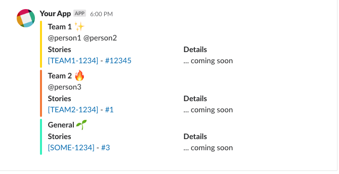

# Captain's Log

A continuous integration plugin that will send release information via slack.

[See More On Captain's Log Documentation Site](https://target.github.io/captains-log/)

# Code Of Conduct

[Code of Conduct](./CODE_OF_CONDUCT.md)
