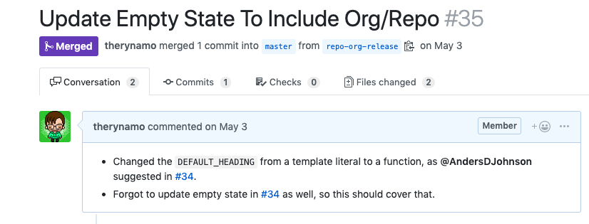

# Pull Request Body

In order for Captain's log to pick up any issues addressed in a pull request, you must include them in the pull request body.

### How to get Captain's Log to pick up an issue

For example:



The linking of _#34_ in the pull request will automatically get picked up by Captain's Log. 

The same goes for all of the github keywords, like "closes #34" (etc.).

Linking Jira tickes is as easy as mentioning them in the ticket.

For example:

```
This PR addresses concerns brought up in [JIRA-234](https://jira.mycompany.com/browse/JIRA-234).

// or

This PR addresses concerns brought up in https://jira.mycompany.com/browse/JIRA-234.
```

### How to allow Captain's Log to explicitly ignore an issue 

There are many reasons that you would want to ignore an issue. One of the most common ones is when you have worked on multiple "sub-tasks" or "sub-tickets" that all roll into a single issue. It can be helpful to reference these in a pull request, especially if they close issues, like the github syntax allows you to do. However, you may just want Captain's Log to reference the "parent" issue on release. 

Ignoring an issue or multiple issues is as easy as placing these issues inside of a Captain's Log _"ignore block"_. It is a simple HTML comment block with two sepcial key words, `icl` and `ecl`. This stands for `ignore captain's log` and `end captain's log` (ignore), respectively. 

Place this in your pull request template, or copy and paste it on a pr basis:

```
<!-- icl -->
https://git.myorg.com/myorg/myrepo/issues/1234

https://jira.target.com/browse/JIRA-212
<!-- ecl -->
```

Next up, [contributing](/contributing/).