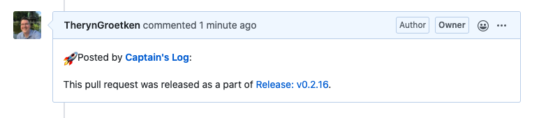
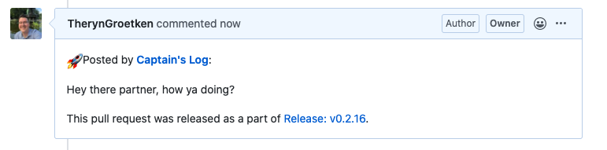

# Pull Request Comments

Captain's Log will comment back on pull requests to let users know what version their pull request got released in. 



## Disabling Comments On Pull Requests

If you use another service for identifying which version of release your pull requests went out on, or don't like it, you can disable this feature.

Set the following in your build step or `.captains.yml`:

```yaml 
github_skip_pr_comment: true
```

## Adding Context to PR Comments

If you'd like there to be more context around what your PR comment should say, we allow for custom content to be interpolated into the comment itself. 

Set the following in your build step or `.captains.yml`:

```yaml
github_pr_text: "Hey there partner, how ya doing?"
```

And the result looks like this:

